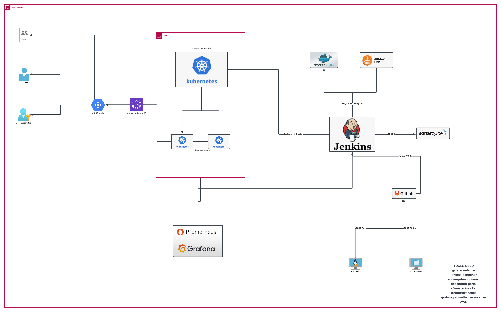

## Setting up DEVOPS PIPELINE
> PLAN 
> CODE 
> TEST 
> BUILD 
> DEPLOY 
> MONITOR

# BASIC ARHC:

# ADVANCE ARHC:

## TOOLS USED
> Gitlab
> Docker / Docker hub
> SonarServer
> Jenkins
> KubernetesCluster/Minicube
> Terraform

## TECHNOLOGY USED
> AWS
> RDS
> EC2
> CICD

