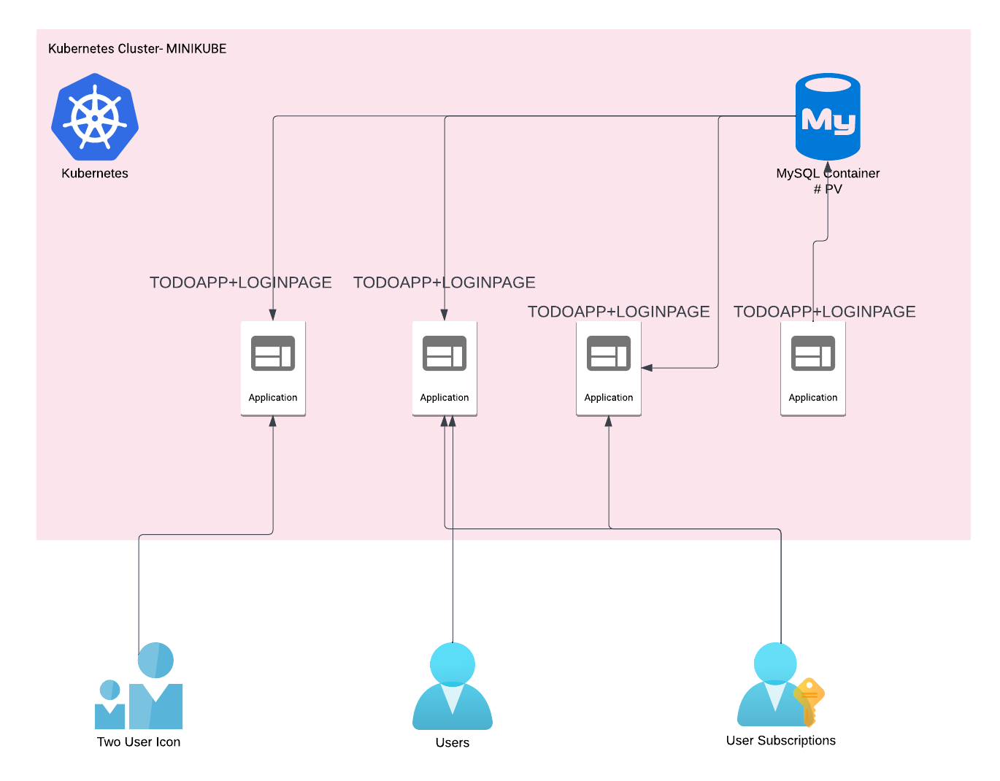

# Deploy 2 TIER TODO APP Cluster on k8s #REPLICA #AUTOHEALING #DB_DTA-PERSISTANT
## ARCHITECTURE- 

## IMP COMMANDS is this setup 
> get dashbaord url of minikube 
minikube dashboard --url
> get the url of minikube to access application page
minikube service two-tier-app-service --url

kubectl get pods/nodes
kubectl get svc
kubectl get pods -o wide
kubectl get deployments

# DB TABLES CREATE FOR TODOAPP DB
- http://IP:PORT/todo-new-app/abc.php  

-- users for login purposes
CREATE TABLE users (
    id INT AUTO_INCREMENT PRIMARY KEY,
    username VARCHAR(50) NOT NULL,
    password VARCHAR(255) NOT NULL
);

INSERT INTO users (username, password) VALUES ('todoapp', 'todoapp');
-- change user and password in upper line 

-- task for todo app
CREATE TABLE tasks (
    id INT AUTO_INCREMENT PRIMARY KEY,
    employee_name VARCHAR(255) NOT NULL,
    task_description TEXT,
    task_date DATE
);